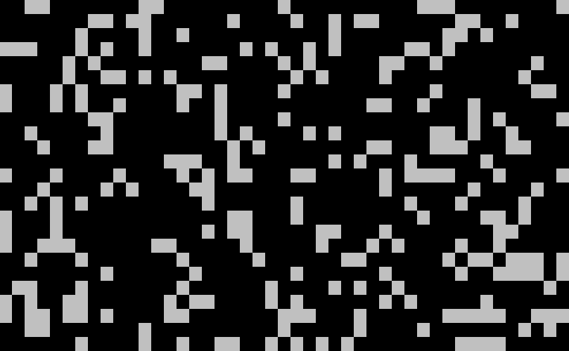

# Path Star

[](https://github.com/yonimn2000/path-star/actions/workflows/nuget-publish.yml)
[](https://www.nuget.org/packages/YonatanMankovich.PathStar)

A simple library that uses the A* path finding algorithm to find paths on 2D grids.

## How to Use

```cs
Size gridSize = new Size(45, 20);
Point startPoint = new Point(0, 0);
Point endPoint = new Point(gridSize.Width - 1, gridSize.Height - 1);
List<Point> wallPoints = new List<Point>();
Random random = new Random();

for (int i = 0; i < gridSize.Width * gridSize.Height * 0.3; i++) // Create random walls points.
    wallPoints.Add(new Point(random.Next(gridSize.Width), random.Next(gridSize.Height)));

IGridAstar gridAstar = new GridAstar(gridSize, startPoint, endPoint, wallPoints);

gridAstar.FindPath();

List<Point> pathPoints = gridAstar.Path;
```

## Visualization



Gray = walls

Blue = closed set

Green = open set

Yellow = path

## My Other Project that Uses This Library

[Command Line Snake](https://github.com/yonimn2000/command-line-snake)
